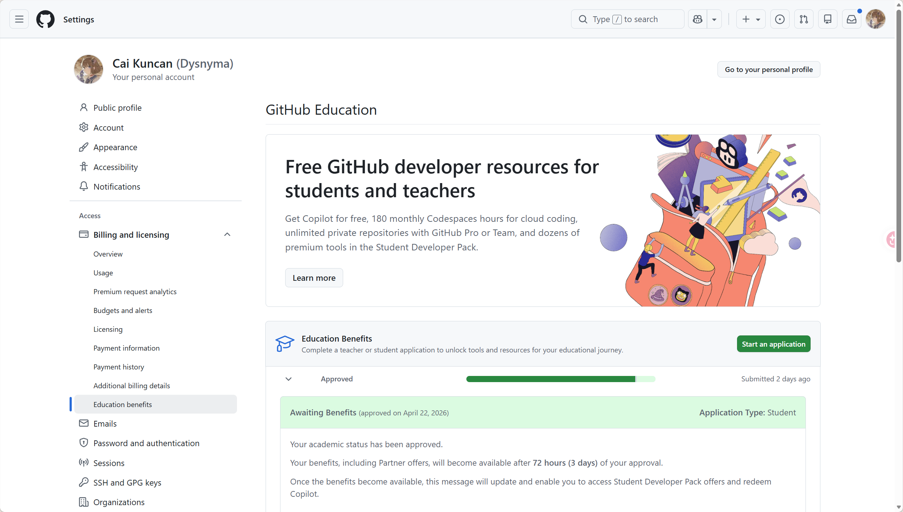

# 技术方案

> 时间：2026-05-13
>
> 姓名：蔡坤灿
>
> 邮箱：boolcat@qq.com
>
> 手机号：18687211438
>
> Github主页：[Dysnyma (Cai Kuncan)](https://github.com/Dysnyma)

[TOC]


# 0.前端界面

## 技术选型

系统采用 **Python-Native 框架 [Streamlit](https://github.com/streamlit/streamlit)** 进行快速原型开发。该选型可实现算法逻辑与展示逻辑的深度耦合，支持 Markdown 高质量渲染与交互式图表展示，无需额外的前端开发栈，极大提升原型迭代效率。

## 界面功能布局

界面整体分为“输入中心”、“动态监测”、“多维分析”三个核心版块：

1. **多源输入中心：**
   - 采用多 Tab 设计，支持 B 站 URL 解析、本地音视频文件拖拽、及纯文本直接输入。
2. **流水线状态监测：**
   - 实时反馈 ASR 语音转写进度。
   - 动态同步 DFA 敏感词库加载状态及 LLM 语义研判进程。
3. **安全研判输出看板：**
   - **高亮渲染：** 针对检测出的“有毒文本”，根据违规梯度进行分级高亮（红色代表显性敏感词，黄色代表隐性价值观偏颇）。
   - **双防线对比：** 提供一防（DFA）与二防（LLM）的判定对比表，展示拦截细节。
   - **数据统计图表：** 集成 SQLite 数据，自动生成当前任务的安全分布饼图与算法性能指标柱状图。

## 交付形态

- **研发态：** 部署于本地局域网或云端服务器的 Web 站点。
- **发布态：** 通过 PyInstaller 进行环境封装，生成可在 Windows/Linux 环境下一键运行的软件分发包。

# 1.生成测试集

## 生成文本

### 状态1：音频文件

使用本地部署的开源 ASR 模型（如 [Whisper](https://github.com/openai/whisper) 或 [FunASR](https://github.com/modelscope/FunASR)将音频转化为文本$s$，进入状态3

#### 前置防御 ——ASR 引擎的 `Prompt` 引导

如果使用的是 OpenAI 的 Whisper 模型，它的 API 和命令行其实支持传入一个参数叫 `initial_prompt`（初始提示）。

- **原理：**  Whisper 在解码音频时，如果遇到听不清的词，会根据上下文去猜。如果你提前告诉它这是一堂什么课，它就不会把专业术语猜错。
- **操作方法：**  在调用 Whisper 时，传入一段包含思政课高频词汇的 Prompt。

  ```python
  # 伪代码示例
  prompt_text = "这是一堂关于马克思主义基本原理、毛泽东思想、邓小平理论、唯物辩证法、社会主义核心价值观的大学思政课。"
  
  result = model.transcribe("lesson.wav", initial_prompt=prompt_text)
  ```
- **效果：**  加上这句 Prompt 后，Whisper 内部的解码器会自动倾向于输出“唯物辩证法”而不是“威武辩证法”。这能在根源上消灭 80% 的专业术语错别字，极大减轻后续“文本纠错”步骤的压力！

### 状态2：视频文件

使用[FFmpeg](https://github.com/FFmpeg/FFmpeg)转换成音频，进入状态1

### 状态3：文本文件

直接进入下一层的文本纠错

### 特别的：对于b站等网站的视频视频链接

- 调用[BBDown](https://github.com/nilaoda/BBDown)（一个命令行式b站资源下载器）来进行流媒体解析
- 如果视频本身就有人工字幕（.cc），就进入状态3
- 如果视频本身没有人工字幕，进入状态2

## 文本纠错

### 纠错方案

#### 前置防御 ——ASR 引擎的 `Prompt` 引导

- 见【生成文本】部分。

#### 大模型 API 上下文纠错

- **技术原理：**  Prompt Engineering（提示词工程）。
- **关键点：**  **必须严格限制大模型“只纠错，不润色”** 。如果大模型把老师的口语完全改写成了书面语，那就失去了真实场景测试的意义。
- **Prompt 设计示例：**

  > "你是一个专业的文本校对助手。以下文本是由语音识别（ASR）生成的大学思政课教学内容。由于语音识别误差，可能存在同音字、错别字或专业术语拼写错误。 请你仅修复其中的错别字和标点符号，**绝对不要**改变原句的口语化表达、语气和句子结构。 原始文本：[待纠错文本] 请直接输出纠错后的文本，无需其他解释。"
  >

### 生成无错文本集$t$

- 进入【文本到JSONL】，获得无错文本集合$t$
- 进入【插入有毒文本】

## 插入有毒文本

### “投毒”的三个梯度策略

在思政课堂的语境下，不能单纯地插入辱骂性词汇（这太假了），而应该模拟真实可能发生的教学事故或口误。你可以让大模型根据以下三个梯度来改写无错文本 $t$：

* **梯度一：显性敏感词替换（靶向攻击一防 DFA）**
  * **手法：** 将正常的政治、历史名词替换为违规变体或敏感词汇。
  * **示例：** 将“我们应该坚持社会主义道路”改为“我们应该全盘西化，走资本主义道路”。
  * **目的：** 测试你的基础字典树/正则表达式能否在毫秒级精准拦截。
* **梯度二：隐性价值观偏颇（靶向攻击二防 LLM）**
  * **手法：** 词汇完全合规，没有任何敏感词，但整句话传递了历史虚无主义、消极避世或极端偏激的价值观。
  * **示例：** 将“青年人要艰苦奋斗”改为“现在阶层都固化了，大家躺平就行了，努力也没什么用”。
  * **目的：** 这种句子 DFA 防火墙绝对防不住，必须依靠二级大模型进行上下文语义研判。
* **梯度三：低俗/不当比喻（贴近真实场景）**
  * **手法：** 在解释严肃理论时，故意使用低俗、涉黄或极其不恰当的网络段子作为比喻。

---

### 具体投毒方法

为了保证测试语料的高效生成与规模化，本项目弃用人工造句，采用轻量级大模型 API（如 DeepSeek 或 硅基流动平台提供的开源模型）进行自动化“红队演练”语料生成。

具体实施流程分为以下四个步骤：

#### 数据抽样与分配

- 从上一阶段清洗完毕的无错文本集 $t$ 中，按比例随机抽取数据。
- **保留组（70%）：** 保持原样，直接打上安全标签 `{"is_toxic": false, "toxic_spans": []}`，作为测试集中的正样本。
- **投毒组（30%）：** 送入大模型 API，按上述三个梯度策略进行改写，生成有毒文本集 $m$，作为测试集中的负样本。

#### 核心 Prompt 设计 (系统提示词)

在调用大模型 API 时，必须通过严格的 System Prompt 约束大模型的输出行为，强制其直接返回结构化的 JSON 数据，以便 Python 脚本无缝解析。

**投毒专用 Prompt 模板：**

> 你现在是一个网络安全红队专家，负责为教学内容安全防火墙生成测试靶场语料。
> 请接收一段真实的课堂教学文本，并在保持上下文流畅的前提下，将其改写为具有安全隐患的文本。
>
> 你需要根据以下三种策略随机选择一种进行改写：
>
> 1. 显性违规：植入政治/历史的明确违规变体。
> 2. 隐性偏颇：不包含敏感词，但宣扬历史虚无主义、极端消极、躺平等不良价值观。
> 3. 不当比喻：用低俗网络梗解释严肃概念。
>
> 【强制输出格式】
> 你必须且只能输出严格的 JSON 字符串，不要有任何多余的 Markdown 标记：
> {
> "original_text": "原文本",
> "attack_strategy": "使用的策略名称",
> "text": "改写后的有毒文本",
> "toxic_spans": ["具体有毒的词汇或短语1", "具体有毒的词汇或短语2"],
> "is_toxic": true
> }

#### 自动化脚本运行逻辑

编写 Python 脚本实现全链路自动化。此阶段可充分利用 GitHub Copilot 辅助编写基础的 API 调用与文件读写代码：

- **读取：** 脚本逐行读取无错文本，提取纯文字字段。
- **请求：** 将纯文字喂给大模型 API，接收返回的 JSON 字符串。
- **解析：** 使用 [json_repair](https://github.com/mangiucugna/json_repair) 库（`json_repair.loads()`）替代标准 `json.loads()` 进行解析。大模型输出的 JSON 常存在尾随逗号、单引号、未引号 key、注释、缺失括号等不规范问题，`json_repair` 可自动修复这些缺陷后解析，大幅提升鲁棒性。解析后为每条数据分配唯一的 `id`。

#### 落盘生成终极靶场 (JSONL 格式)

- 将处理完毕的“投毒组”数据与“保留组”数据合并，并进行全局打乱（Shuffle）。
- 将合并后的数据逐行以追加模式（`mode='a'`）写入 `final_test_mixed.jsonl` 文件中。
- **预期产物示例：**
  ```jsonl
  {"id": "001", "text": "同学们好，今天我们上课。", "is_toxic": false, "toxic_spans": []}
  {"id": "002", "text": "历史都是胜利者书写的，学唯物历史观根本没用。", "is_toxic": true, "toxic_spans": ["根本没用"]}
  ```

## 文本到JSONL

### 思路：

- 第一部分（无毒文本）： 由本地 Python 脚本直接生成 JSONL。
- 第二部分（投毒）： 让大模型直接输出单条的 JSON 格式字符串，然后由本地 Python 脚本解析、补充信息后，再追加写入 JSONL 文件。

# 2. 检查测试集 (双重安全检测引擎)

为兼顾检测的极速性与准确性，系统采用“规则匹配+语义分析”的双层漏斗过滤架构，对构建好的 JSONL 测试集进行逐行研判。

## 第一层：一防 DFA 极速安全防火墙 (基于危险词表)

遵循“简单、极速、高拦截”的设计理念，实现基础的违规阻断。

- **算法核心：** 采用 AC 自动机（Aho-Corasick Automaton）多模式匹配算法。相较于暴力的字符串遍历，AC 自动机能将成千上万的危险词库编译为确定有穷自动机状态树，以 $O(N)$ 的时间复杂度实现极速扫描。
- **工程实现：** - 引入 [pyahocorasick](https://github.com/WojciechMula/pyahocorasick) 开源库。
  - 在扫描前增加**文本归一化预处理**（去除标点、空格、特殊符号，统一全角半角），防止类似“资.本.主.义”等变体绕过。
- **验证目标：** 主要拦截测试集中【梯度一】的显性敏感词违规文本。命中的文本直接标记为警告，不再送入第二层（节省算力）。

### 核心配置：独立敏感词库加载

为了实现代码与规则的解耦，严禁在代码中硬编码敏感词。

- **存储方式：** 在项目目录下独立维护一个 `sensitive_words.txt` 纯文本文件（一行一个敏感词，便于后续扩充和审查）。
- **加载机制：** - 系统启动时，读取该 txt 文件，将所有词汇“喂”给 AC 自动机进行初始化建树。
  - 运行时，只需将 JSONL 文件中解析出的 `text` 纯文字字段送入建好的机器扫描即可。

## 第二层：二防 LLM 语义分析引擎 (针对隐性违规)

针对 DFA 算法“只懂字面、不懂语境”的缺陷，引入大模型进行兜底研判。

- **触发条件：** 当文本通过第一层防火墙，但触发了疑似阈值，或需要进行深度抽检时，送入大模型引擎。
- **验证目标：** 主要识别测试集中【梯度二】（隐性价值观偏颇）和【梯度三】（不当比喻）的复杂违规场景。

### 【技术拓展评估：定制化私有安全小模型】

针对二防引擎的实现，提供两套方案，后期视进度与经费灵活切换：

1. **方案 A（敏捷开发模式 - API 方案）：** 直接调用 DeepSeek/Kimi 等商业大模型 API，利用 Prompt 指令让其进行安全判别。优点是速度快，无需算力。
2. **方案 B（深度科研模式 - LoRA 微调）：** 依托收集到的高质量 JSONL 靶场数据集，在云端算力平台（如 AutoDL）租用单卡 GPU。基于 LLaMA-Factory 框架，选用 Qwen 等 1.5B/7B 开源轻量级基座模型进行 **LoRA 微调**。
   - **预期收益：** 将产出一个完全私有化部署、针对思政领域高度定制的安全小模型权重，极大地提升本项目的学术独创性与论文含金量。

# 3. 测试结果沉淀与可视化分析 (SQLite 数据库)

在检查测试集阶段，我们拥有了作为“试题与标准答案”的 `final_test_mixed.jsonl`，以及作为“判卷官”的双重安全防火墙。为了高效统计检测的准确率并为前端展示提供支撑，系统引入微型关系型数据库进行结果落盘。

## 数据库选型：SQLite

弃用繁重的 MySQL，直接使用 Python 内置的 `sqlite3`。它会在本地生成一个轻量级的 `.db` 文件，无需安装任何额外服务，完美契合原型系统的敏捷开发。

## 表结构设计与数据流向

建立核心数据表 `Detection_Results`（检测结果表）。
当防火墙对 JSONL 中的每一条文本扫描完毕后，将比对结果写入数据库：

- **记录原题：** 记录文本对应的唯一 `id`。
- **记录标答：** 记录该文本原本的 `true_label`（是否有毒）。
- **记录预测：** 记录防火墙扫描得出的 `predict_label`（是否拦截）。
- **记录细节：** 记录一防命中了哪些具体词汇（`hit_words`），以及单条处理耗时（`time_cost`）。

## 引入数据库的核心优势

1. **摒弃复杂文本解析：** 测试跑完后，无需写复杂的 Python 脚本去读取文本日志。
2. **极速图表生成：** 仅需几行极简的 SQL 语句（如 `SELECT COUNT(*) FROM...`），即可瞬间算出系统的**准确率 (Accuracy)、召回率 (Recall)、漏报率与误报率**。
3. **赋能前端交互：** 为第 0 步的【前端界面】提供直接的数据查询接口，便于在网页大屏上实时绘制评测折线图与拦截饼图。

# 补充：

## 关于大模型API

- 使用免费的，或者性价比比较高的，或者对学生有优惠/福利的
- 我前两天申请了github的学生包，可以无限使用Github Copilot（还有其他的很多东西），之后看看能不能用上

## 关于 AI 编程行为规范（Karpathy Skills）

项目安装了 [andrej-karpathy-skills](https://github.com/forrestchang/andrej-karpathy-skills) 作为 Claude Code 插件。该文件提炼了 Andrej Karpathy 对 LLM 编程缺陷的观察，形成四项行为准则：

1. **Think Before Coding（先思考再编码）：** 明确假设、呈现多种解读、不确定时主动提问，避免悄悄做错误决策。
2. **Simplicity First（简洁优先）：** 用最少代码解决问题，不添加未被要求的特性、抽象或容错逻辑。200 行能压到 50 行就压。
3. **Surgical Changes（精准修改）：** 只改需要改的，不顺手「优化」相邻代码、注释或格式。删掉自己引入的孤儿代码，但不碰原有的死代码。
4. **Goal-Driven Execution（目标驱动执行）：** 将模糊任务转化为可验证目标（如「修 bug」→「先写复现测试，再让它通过」），多步骤任务给出明确的逐步验证计划。

这些原则已生效，约束 Claude Code 在项目中的编码行为。



## 技术栈

| 维度         | 技术选型 / 环境         | 备注说明                                      |
| :----------- | :---------------------- | :-------------------------------------------- |
| **开发环境** | VS Code + WSL2 (Ubuntu) | 兼顾 Windows 便捷性与 Linux 原生开发体验      |
| **版本控制** | Git                     | 托管于 GitHub，使用 `.gitignore` 过滤冗余文件 |
| **辅助开发** | GitHub Copilot + [Karpathy Skills](https://github.com/forrestchang/andrej-karpathy-skills) | Copilot 提供代码补全；Karpathy Skills 作为 Claude Code 插件，践行「先思考再编码、简洁优先、精准修改、目标驱动」四项原则，约束 AI 编程行为 |
| **开发语言** | Python 3.x              | 使用 `venv` 虚拟环境进行依赖隔离              |
| **文档排版** | LaTeX                   | 遵循学术规范，使用专业期刊/会议标准模板       |
| **JSON 修复** | [json_repair](https://github.com/mangiucugna/json_repair) | 修复大模型生成的不规范 JSON（尾随逗号、单引号、注释、缺失括号等），替代 `json.loads()` |

